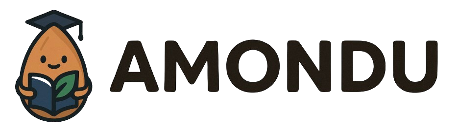
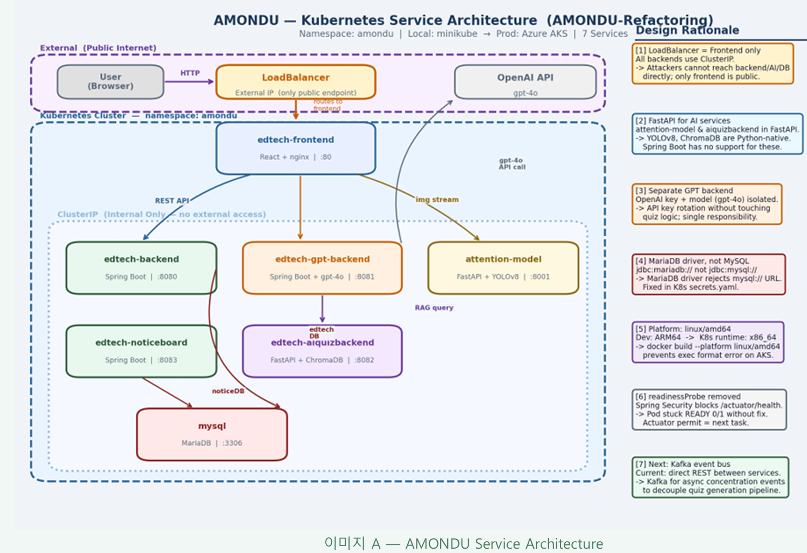

<p align="center">
  
</p>

<h1 align="center">AMONDU-Refactoring</h1>

<p align="center">
  AI 기반 실시간 집중도 분석 이러닝 플랫폼 <b>AMONDU</b>를<br/>
  <b>Azure AKS → Minikube 로컬 K8s</b> 배포 구조로 전환하고,<br/>
  서비스 경계를 다시 그어 <b>MSA(Microservice Architecture)</b>로 재개편한 리팩터링 프로젝트입니다.
</p>

<p align="center">
  <a href="https://github.com/JongMoon-01/AMONDU-Refactoring/actions/workflows/ci-cd.yml">
    
  </a>
</p>

> KT AIVLE School 빅프로젝트로 만들어진 AMONDU 레거시 코드를 기반으로, 배포/아키텍처 레벨에서 다시 설계하는 개인 리팩터링 리포지토리입니다.

---

## 목차

- [프로젝트 소개](#프로젝트-소개)
- [리팩터링 배경 및 방향](#리팩터링-배경-및-방향)
- [아키텍처](#아키텍처)
- [서비스 구성](#서비스-구성)
- [Kafka 이벤트 흐름](#kafka-이벤트-흐름)
- [기술 스택](#기술-스택)
- [디렉토리 구조](#디렉토리-구조)
- [로컬 실행 방법 (Minikube)](#로컬-실행-방법-minikube)
- [CI/CD](#cicd)
- [트러블슈팅](#트러블슈팅)
- [리팩터링 로드맵](#리팩터링-로드맵)

---

## 프로젝트 소개

**AMONDU**는 실시간 얼굴 인식(표정·시선 추적)을 통해 학습자의 수업 집중도를 측정하고, 수강 이력을 기반으로 AI가 퀴즈와 강의 요약을 생성해주는 이러닝 플랫폼입니다.

- 강의 수강, 수강신청, 게시판/QnA 등 기본 이러닝 기능
- 웹캠 기반 감정·시선 인식으로 실시간 집중도(Focus Score) 측정
- OpenAI GPT 기반 강의 요약 및 RAG 기반 AI 퀴즈 자동 생성

이 리포지토리는 원본 서비스 로직은 유지하면서, **배포 인프라와 서비스 간 데이터/통신 구조를 리팩터링**하는 데 집중합니다.

## 리팩터링 배경 및 방향

기존 AMONDU는 Azure AKS(Azure Kubernetes Service) + ACR(Azure Container Registry)를 전제로 배포 파이프라인이 짜여 있었습니다. 이 리포지토리에서는 다음 두 축으로 리팩터링을 진행했습니다.

**1. 배포 인프라: Azure AKS → Minikube**

- 클라우드 비용/의존성 없이 로컬에서 전체 MSA 스택을 재현할 수 있도록 `minikube` 기반 배포로 전환
- 6개 애플리케이션 서비스 + MySQL + Kafka/Zookeeper를 로컬 K8s 클러스터(`amondu`, `kafka` 네임스페이스)에서 기동
- GitHub Actions CD 잡은 AKS 배포 코드를 그대로 보존하되 현재는 `if: false`로 비활성화해두어, Azure Secrets만 등록하면 즉시 재활성화 가능한 구조로 남겨둠

**2. 구조: 모놀리식적 데이터 결합 → MSA**

서비스는 이미 리포지토리 단위로 분리되어 있었지만, 실제로는 서비스 간 테이블이 중복되고 직접 참조하는 등 **MSA 원칙(Database per Service)이 지켜지지 않은 상태**였습니다. 이를 다음과 같이 재개편했습니다.

- `attention` 서비스의 자체 `User` 테이블 제거 → `edtech-backend`가 발급한 JWT의 `userId`를 그대로 신뢰하는 구조로 전환 (서비스 간 유저 동기화 문제 제거)
- `aiquiz` 서비스의 `Summary` 테이블 중복 제거 → `edtech-backend`의 `Summary`를 단일 소스로 사용
- 서비스 간 동기 호출/직접 DB 참조 대신 **Kafka 기반 이벤트 드리븐 통신**(`enrollment.created`, `attention.score.measured`, `quiz.generated`) 도입
- `CourseEngagementAnalytics`의 원시 JSON 배열(`attentionArr`) 저장 방식을 **CQRS 스타일 집계 컬럼**(`avgFocusScore`, `focusDropCount`)으로 교체해 조회 성능과 실시간 처리 가능성 확보
- Saga(Choreography) / Outbox 패턴을 다음 단계 설계로 적용 예정 (수강신청 → 세션 생성 → Kafka 이벤트 전파 흐름의 메시지 유실 방지)

## 아키텍처

<p align="center">
  
</p>

**설계 근거**

1. **LoadBalancer는 frontend만** — 나머지 서비스는 전부 `ClusterIP`. 외부에서 backend/AI/DB에 직접 접근할 수 없고, 공개 진입점은 frontend 하나뿐.
2. **AI 서비스는 FastAPI** — attention-model과 aiquizbackend는 YOLOv8·ChromaDB 등 Python 생태계 의존성이 커서 Spring Boot 대신 FastAPI 채택.
3. **GPT 백엔드 분리** — OpenAI 키/모델(gpt-4o) 설정을 별도 서비스로 격리, 퀴즈 로직 건드리지 않고 API 키 교체 가능.
4. **MariaDB 드라이버 URL 수정** — `jdbc:mariadb://`가 아닌 `jdbc:mysql://`를 쓰면 드라이버가 URL을 거부하는 문제를 K8s `secrets.yaml`에서 수정.
5. **`--platform linux/amd64` 빌드** — 개발 머신(ARM64)과 K8s 런타임(x86_64) 아키텍처 불일치로 인한 `exec format error` 방지.
6. **readinessProbe 제거** — Spring Security가 `/actuator/health`를 차단해 Pod가 `READY 0/1`에 머무는 문제의 임시 조치. Actuator 허용 설정이 다음 과제.
7. **다음 단계: Kafka 이벤트 버스** — 현재는 서비스 간 동기 REST 호출 위주이며, 집중도 이벤트를 비동기로 흘려 퀴즈 생성 파이프라인을 분리하는 것이 다음 목표.

## 서비스 구성

| 서비스 | 스택 | 포트 | DB | 역할 |
|---|---|---|---|---|
| `edtech-frontend` | React 19 + Tailwind, nginx | 80 | - | 사용자 웹 클라이언트 (강의, 수강신청, 대시보드, 공지/QnA, 웹캠 스트리밍) |
| `edtech-backend` | Spring Boot 3.5 (Java 17) | 8080 | MariaDB `edtech` | 인증(JWT), 강의/수강신청/유저 코어 도메인, 집중도 집계 수신, Kafka 이벤트 오케스트레이션 |
| `edtech-noticeboard` | Spring Boot 3 (Java 17) | 8083 | MariaDB `noticeboard` | 공지사항, QnA 게시판 |
| `edtech-gpt-backend` | Spring Boot 3 (Java 17) | 8081 | - | OpenAI GPT 연동 (강의 요약 등) |
| `edtech-aiquizbackend` | FastAPI (Python 3.10) | 8082 | MySQL `aiquiz` + ChromaDB(RAG) | 강의 요약 기반 RAG 검색 및 AI 퀴즈 자동 생성 |
| `attention-model-fastapi-service` | FastAPI + TensorFlow/OpenCV/dlib | 8001 | MySQL `focus_analysis` | 웹캠 프레임 기반 실시간 감정·시선 인식 및 집중도(Focus Score) 산출 |
| `mysql` | MySQL 8.0 | 3306 | - | 서비스별 스키마를 물리적으로 분리해 사용하는 공유 DB 인스턴스 |
| `kafka` / `zookeeper` | Confluent Platform 7.5.0 | 9092 / 2181 | - | 서비스 간 이벤트 브로커 (`kafka` 네임스페이스로 분리 배포) |

> 각 서비스는 자체 Dockerfile(`docker/<서비스명>/Dockerfile`)과 K8s 매니페스트(`k8s/<서비스명>/`)를 가지며, `ClusterIP`로 내부 통신하고 프론트엔드만 `LoadBalancer`로 노출됩니다.

## Kafka 이벤트 흐름

| 토픽 | Producer | Consumer | 설명 |
|---|---|---|---|
| `enrollment.created` | `edtech-backend` | `attention-model-fastapi-service` | 수강신청 발생 시 발행 → 집중도 분석 세션 준비 트리거 |
| `attention.score.measured` | `attention-model-fastapi-service` | `edtech-backend` | 강의 세션의 집중도 측정 결과(평균 집중도, 집중 저하 횟수 등) 발행 → `CourseEngagementAnalytics` 집계 반영 |
| `quiz.generated` | `edtech-aiquizbackend` | `edtech-backend` | AI 퀴즈 생성 완료 시 발행 → 학습 이력/알림 반영 |

적용/적용 예정 패턴:

- **Database per Service** — 서비스별 스키마 분리, 서비스 간 직접 DB 참조 제거
- **CQRS** — `CourseEngagementAnalytics`처럼 조회 전용 집계 컬럼을 별도 관리
- **Saga (Choreography)** — 수강신청 → 집중도 세션 생성 → 이벤트 전파의 분산 트랜잭션 흐름
- **Outbox Pattern** (예정) — `attention` → `backend` 이벤트 전송 시 메시지 유실 방지

## 기술 스택

**Frontend**
React 19, React Router, Tailwind CSS, Chart.js/Recharts, react-webcam, shaka-player, Axios

**Backend (Spring Boot 3.5 / Java 17)**
Spring Web/WebFlux, Spring Data JPA, Spring Security + OAuth2 Resource Server, JJWT, spring-kafka, Micrometer + Prometheus, MariaDB Driver

**AI/Backend (Python / FastAPI)**
FastAPI, SQLAlchemy, TensorFlow, OpenCV, dlib(L2CS-Net 기반 시선 추정), ONNX Runtime, aiokafka/kafka-python, ChromaDB + BM25(RAG), OpenAI API, prometheus-fastapi-instrumentator

**Infra / DevOps**
Docker (multi-stage build), Kubernetes(Minikube), Kafka + Zookeeper(Confluent), GitHub Actions CI, MySQL 8 / MariaDB

## 디렉토리 구조

```
AMONDU-Refactoring/
├── edtech-frontend/                  # React 프론트엔드
├── edtech-backend/                   # Spring Boot - 코어 도메인 (인증/강의/수강신청)
├── edtech-noticeboard/               # Spring Boot - 공지/QnA
├── edtech-gpt-backend/               # Spring Boot - GPT 연동
├── edtech-aiquizbackend/             # FastAPI - RAG 기반 AI 퀴즈
├── attention-model-fastapi-service/  # FastAPI - 집중도(감정/시선) 분석
├── docker/                           # 서비스별 Dockerfile, nginx.conf 등 빌드 컨텍스트
├── docs/
│   └── architecture.png              # K8s 서비스 아키텍처 다이어그램
├── k8s/                              # 서비스별 Deployment/Service 매니페스트
│   ├── namespace.yaml
│   ├── kafka/                        # Kafka/Zookeeper (kafka 네임스페이스)
│   ├── mysql/
│   ├── backend/ noticeboard/ gpt-backend/ aiquiz/ attention/ frontend/
├── .github/workflows/ci-cd.yml       # CI (빌드/테스트) + CD (AKS, 현재 비활성화)
└── 2026-06-02-devlog.md              # Minikube 배포 작업 일지 (트러블슈팅 원본 기록)
```

## 로컬 실행 방법 (Minikube)

```powershell
# 1. Minikube 클러스터 시작
minikube start

# 2. 네임스페이스 & 인프라 생성
kubectl apply -f k8s/namespace.yaml
kubectl apply -f k8s/kafka/deployment.yaml   # kafka 네임스페이스 + Zookeeper + Kafka
kubectl apply -f k8s/mysql/

# 3. 시크릿 생성 (k8s/secrets-template.yaml은 git에 커밋하지 않음 — 직접 생성 필요)
#    amondu-secrets 이름으로 아래 키를 포함해야 합니다:
#    SPRING_DATASOURCE_URL / USERNAME / PASSWORD, JWT_SECRET,
#    GPT_API_KEY, OPENAI_API_KEY, DATABASE_URL,
#    MYSQL_ROOT_PASSWORD, MYSQL_PASSWORD
kubectl apply -f k8s/secrets-template.yaml

# 4. 각 서비스 이미지 빌드 후 Minikube 내부로 주입 (예: frontend)
minikube docker-env -u | Invoke-Expression   # 원래 Docker 데몬으로 복귀 후 빌드
docker build -t edtech-frontend:latest -f docker/edtech-frontend/Dockerfile edtech-frontend/
minikube image load edtech-frontend:latest
# 나머지 서비스(backend, noticeboard, gpt-backend, aiquizbackend, attention-model-fastapi-service)도 동일하게 반복

# 5. 서비스 매니페스트 적용
kubectl apply -f k8s/backend/ -f k8s/noticeboard/ -f k8s/gpt-backend/ -f k8s/aiquiz/ -f k8s/attention/ -f k8s/frontend/

# 6. 상태 확인 및 접속
kubectl get pods -n amondu
minikube service frontend-service -n amondu
```

이미지 재빌드, 강제 이미지 교체, MySQL 접속 등 반복 작업용 명령어는 [`2026-06-02-devlog.md`](./2026-06-02-devlog.md)에 정리되어 있습니다.

## CI/CD

`.github/workflows/ci-cd.yml` 기준, `main` 브랜치 push/PR마다 아래 CI가 자동 실행됩니다.

- **ci-frontend** — Node 20, `npm ci` → 테스트 → `CI=false npm run build`
- **ci-backend** — Java 17(Temurin), `edtech-backend` / `edtech-noticeboard` / `edtech-gpt-backend` 3개 서비스에 대해 Gradle 빌드 (matrix)
- **ci-python** — Python 3.10, `attention-model-fastapi-service` / `edtech-aiquizbackend`에 대해 flake8 문법 검사 (matrix)
- **cd-deploy** — Azure ACR push + AKS 롤아웃 재시작. `AZURE_CREDENTIALS`, `ACR_NAME`, `AKS_CLUSTER`, `AKS_RESOURCE_GROUP` 시크릿을 등록하고 `if: false`를 제거하면 즉시 활성화되는 구조로 보존 중

## 트러블슈팅

Minikube 전환 과정에서 겪은 주요 이슈와 해결 과정(Dockerfile build context, `libgl1-mesa-glx` → `libgl1` 패키지명 변경, `minikube docker-env` 사용 시 DNS 차단, ARM64/AMD64 아키텍처 불일치, MariaDB 드라이버 URL 불일치, readinessProbe 403 이슈, Minikube 이미지 캐시 미갱신 등)은 [`2026-06-02-devlog.md`](./2026-06-02-devlog.md)에 원본 기록으로 남아 있습니다.

## 리팩터링 로드맵

- [x] 6개 서비스 Dockerfile 작성 및 Minikube 로컬 배포
- [x] Kafka/Zookeeper 인프라 구축 및 3개 토픽(`enrollment.created`, `attention.score.measured`, `quiz.generated`) Producer/Consumer 구현
- [x] `attention` 서비스 자체 User 테이블 제거, JWT 기반 `userId`로 통합
- [x] `CourseEngagementAnalytics.attentionArr` → `avgFocusScore` / `focusDropCount` 집계 컬럼 교체
- [ ] `aiquiz` 서비스 `Summary` 테이블 중복 제거 (edtech `Summary` 단일 참조)
- [ ] attention API 통합 (`/gaze`, `/analyze/gaze/*` 4종 → `/analyze` 1개로)
- [ ] Outbox 패턴 적용 (Kafka 메시지 유실 방지)
- [ ] Prometheus + Grafana 모니터링 대시보드 구축
- [ ] GitHub Actions CD → Azure AKS 재연결
- [ ] Spring Security actuator 엔드포인트 허용 설정 (`edtech-backend` readinessProbe 정상화)
- [ ] Minikube 레지스트리 구성으로 이미지 영속성 확보
